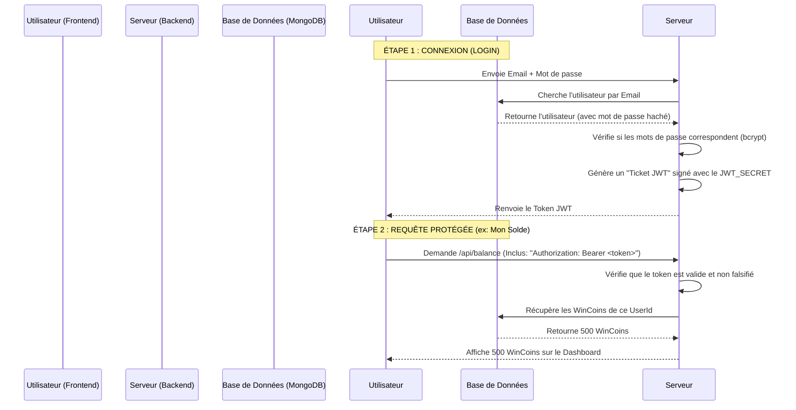

# 🏆 Rapport de Réalisation : Migration JWT & Admin Dashboard (WinSpot)

Ce document résume l'ensemble des travaux majeurs accomplis durant notre session. Nous sommes passés d'un système dépendant d'un service externe payant (Clerk) à une infrastructure 100% propriétaire, sécurisée et sur-mesure.

---

## 1. 🧹 L'Éradication de Clerk & Création de l'Auth JWT

**Problème initial :** Clerk rendait le code complexe (webhooks capricieux), ajoutait une dépendance externe, et causait des bugs lors des changements de rôles (Restaurant vs Influenceur).
**Solution :** Suppression totale de Clerk et implémentation de notre propre système de **JSON Web Tokens (JWT)**.

### Comment ça marche maintenant ? (Le cycle JWT)



### Ce qui a été codé :
*   **Backend (`/backend/src`)** :
    *   Mise à jour du modèle `User.js` : suppression de `clerkId`, ajout du champ `password`.
    *   Création de `authController.js` (Logique de hashage des mots de passe avec `bcryptjs` et création de `jsonwebtoken`).
    *   Création du middleware `auth.js` : Vérifie à chaque requête si le ticket JWT est valide.
    *   Suppression des webhooks (qui servaient à synchroniser Clerk avec MongoDB).
*   **Frontend (`/frontendWeb/src`)** :
    *   Suppression de `@clerk/clerk-react`.
    *   Création de `AuthContext.jsx` : Stocke le token JWT dans le navigateur (localStorage) et garde l'utilisateur connecté.
    *   Création de nos propres formulaires de Login/Register pour les Restaurants et les Influenceurs.
    *   Création de `RoleGuard.jsx` pour empêcher un Influenceur d'entrer dans le Dashboard Restaurant.

---

## 2. 👑 Refonte de l'Admin Dashboard

Nous avons complètement métamorphosé le panneau d'administration (qui était très basique) en un véritable centre de contrôle professionnel.

### Ce qui a été codé :
*   **Design Premium (Dark Mode & Glassmorphism)** :
    *   Ajout de la police moderne *Outfit*.
    *   Mise en place d'un arrière-plan dynamique avec des halos lumineux.
    *   Effets de verre dépoli (blur) sur les panneaux et animations de survol (hover) sur les tableaux.
*   **Nouveau Layout (Barre Latérale)** :
    *   Création d'une "Sidebar" à gauche pour naviguer facilement entre "🏪 Merchants", "📱 Influencers" et "💸 Cashouts".
*   **Cartes de Statistiques (KPI)** :
    *   Ajout de blocs en haut de l'écran affichant en temps réel le nombre total d'inscrits et la quantité totale de WinCoins en circulation.
*   **Contrôle Total (Suppression d'utilisateurs)** :
    *   Création d'une route Backend (`DELETE /api/admin/users/:id`) pour détruire un compte.
    *   Ajout d'un bouton 🗑️ (Supprimer) dans l'Admin Dashboard avec message de confirmation.

---

## 3. 💸 Le Système de Retrait (Cashout)

C'est la fonctionnalité qui permet aux influenceurs de transformer leurs WinCoins virtuels en argent réel.

### Comment ça marche ? (Le workflow Cashout)

```mermaid
flowchart TD
    A[L'Influenceur veut retirer 50 WinCoins] --> B{A-t-il plus de 20 WinCoins ?}
    B -- Non --> C[Erreur : Solde Insuffisant]
    B -- Oui --> D[Choisit: PayPal (Email) ou RIB (Banque)]
    D --> E[L'API déduit 50 WinCoins de son compte]
    E --> F[Transaction créée en statut 'PENDING']
    
    F --> G((Admin Dashboard))
    
    G --> H{L'Admin voit la demande dans l'onglet Cashout}
    
    H -- Clique sur Rejeter ❌ --> I[Statut passe à 'FAILED']
    I --> J[Les 50 WinCoins sont remboursés à l'influenceur]
    
    H -- Fait le virement en vrai + Clique sur Approuver ✅ --> K[Statut passe à 'COMPLETED']
    K --> L[L'argent est envoyé, les WinCoins sont détruits]
```

### Ce qui a été codé :
*   **Mise à jour du Modèle `Transaction.js`** :
    *   Ajout de `paymentMethod` (PayPal ou Banque).
    *   Ajout de `paymentDetails` (Email ou code RIB).
*   **Routes Admin dédiées** :
    *   `GET /api/admin/withdrawals/pending` : Liste toutes les demandes en attente.
    *   `POST .../approve` : Valide la demande définitivement.
    *   `POST .../reject` : Annule la demande et rembourse l'influenceur.
*   **L'Interface Admin (Onglet Cashouts)** :
    *   Affichage d'un compteur rouge (ex: "2") sur la barre latérale si des paiements attendent.
    *   Un tableau lisible affichant la méthode choisie (tag vert/bleu) et les infos de paiement (Email ou RIB) pour que l'admin puisse procéder au virement depuis sa propre banque.

---

**C'est une base extrêmement solide. Le système ne dépend plus de personne, vous avez la main absolue sur les bases de données, l'authentification et l'économie du jeu.**

---

## 4. 🚧 Ce qu'il reste à faire (La To-Do List Finale)

Maintenant que l'architecture backend et admin est finalisée, voici les pièces manquantes pour que le projet soit prêt pour le marché :

### 🔴 Phase 1 : Connecter le Frontend Utilisateur (Haute Priorité)
Actuellement, les Dashboards Restaurant et Influenceur côté React (`frontendWeb`) affichent des données statiques (mock data).
* **Affichage Réel** : Il faut modifier `RestaurantDashboard.jsx` et `InfluencerDashboard.jsx` pour qu'ils fassent des requêtes réelles vers notre API (`/api/offers`, `/api/missions`, `/api/transactions/balance`) en utilisant le token JWT dans les headers de la requête (`Authorization: Bearer <token>`).
* **Demande de Retrait (Frontend)** : Il faut créer le formulaire modal dans le dashboard Influenceur pour saisir le `paymentMethod` (PayPal/Bank), le `paymentDetails` (Email/RIB) et appeler l'endpoint `POST /api/transactions/withdraw`.

### 🟠 Phase 2 : Création des Offres & Images
* **Formulaire de Création** : Le Merchant doit pouvoir créer des Offres avec une description, un prix en WinCoins et une image de couverture.
* **Upload Cloudinary / S3** : Il faut configurer un système de stockage d'image (ex: Cloudinary) côté Backend (via Multer) pour recevoir les fichiers uploadés par le Merchant, les stocker sur le cloud, et enregistrer l'URL dans MongoDB.

### 🟡 Phase 3 : La Boucle O2O & Vérification IA des Stories
C'est le système central (Online-To-Offline) de validation des visites et du contenu.
* **Le scan QR Code (En magasin)** :
  * **Génération Frontend** : Quand l'influenceur accepte une mission, l'application génère un QR Code unique (`userId` + `missionId`).
  * **Scan App Merchant** : Le restaurateur scanne ce code pour prouver que l'influenceur est bien venu physiquement.
* **🤖 La validation IA de la Story (En ligne - Instagram Graph API)** :
  * **Connexion** : L'influenceur connecte son compte Instagram (Créateur/Business) à WinSpot via Facebook Login.
  * **Analyse NLP / Vision** : Dès qu'une story est postée, notre API la récupère et l'envoie à une IA (ex: GPT-4 Vision) pour vérifier le contexte (ex: "est-ce qu'on voit bien le burger du restaurant X ?").
  * **Le Check des 24h** : Un *Cron Job* (tâche automatisée sur le serveur) se réveille 23h55 après le post pour interroger l'API Instagram. Si la story est toujours là, la mission est validée et les WinCoins sont transférés ! Sinon, la mission échoue.

### 🟢 Phase 4 : L'Application Mobile React Native
L'application `frontendMobile` de WinSpot contient encore les anciennes traces d'authentification.
* **Refonte de l'Auth Mobile** : Remplacer l'ancienne logique (Clerk/Mocks) par des appels réseau classiques à notre `/api/auth/login` et stocker le JWT dans `expo-secure-store`.
* **Synchronisation** : Connecter l'application mobile pour qu'elle consomme les mêmes API de base (affichage de la carte, des offres, et scan QR Code) que le Web.
