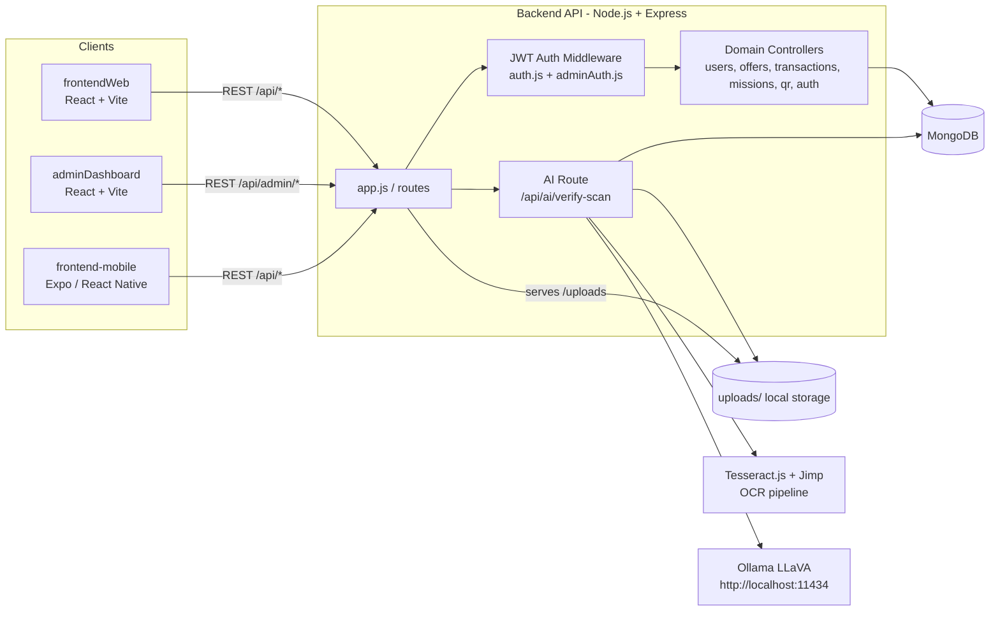

# WinSpot Architecture Diagram

This diagram reflects the current monorepo structure and backend integrations found in code.

## System Overview

## Main Request Paths

1. Auth and user flows:
- Clients call `/api/auth/*`.
- Backend issues JWT tokens and protects private routes via `Authorization: Bearer <token>`.

2. Business flows:
- Merchants create offers and reserve WinCoins budget.
- Influencers receive gains or request withdrawals.
- Admin reviews withdrawals, top-ups, and AI verification data.

3. AI verification flow:
- Client uploads image to `/api/ai/verify-scan` (multer -> `uploads/`).
- OCR extracts visible text (`tesseract.js` + preprocessing via `jimp`).
- Scene classification calls local Ollama LLaVA.
- Result is stored in `FineTuneData` and linked to a transaction when provided.

## Route Map (High Level)

- `/api/health`
- `/api/auth`
- `/api/admin`
- `/api/offers`
- `/api/transactions`
- `/api/users`
- `/api/missions`
- `/api/qr`
- `/api/ai`
